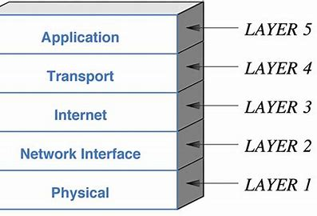
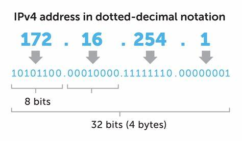

# INTRODUCTION
In this micro-byte, we'll learn about IPV4 addressing formats.
  
 

## BACKGROUND
#### WHAT IS A COMPUTER NETWORK?
A network is a collection of computers, servers, routers, switches, or other devices connected to one another to allow the sharing of data and information.
  
#### WHAT IS THE INTERNET? 
Internet is a **computer network** that connects hundreds of thousands of computer devices throughout the world.  
#### WHAT ARE PROTOCOLS?
Protocols refer to to some sort of rule or standard . In the jargon of computer networks,there are 2 main protocols in use - 
**Transmission Control Protocol (TCP)** and the **Internet Protocol(IP)**.  
The IP protocol specifies the format of the packets sent between routers and end systems.   
> A protocol defines the format and the order of messages exchanged between two or more communicating entities, as well as the actions taken on the transmission and/or receipt of a message  or other event.

 
End systems, routers,switches and other pieces of the Internet run protocols that control the sending and receiving of information within the Internet.
 

**The internet's principal protocols are collectively known as TCP/IP protocols.**

 

Given this basic introduction to Computer Networks, how do you think these numerous protocols and devices in the network are communicate and operate with each other? How is the entire structure organised?
 
* To provide structure to the design of network protocols, and the network hardware and software that implement the protocols are organised in **layers**.  
* Each protocol belongs to one of the layers.  
* Each layer provides its service by:  
  - Performing certain actions within that layer and  
  - Using the services of the layer directly below it.
 
When taken together, the protocols of the various layers are called the **protocol stack**. 

The Internet protocol stack consists of five layers:  
 
  **physical, link, network, transport, and application layers** as shown in the figure.   

  
**FURTHER EXPLORATION**  
Look at the the functionalities offered by the different layers in the TCP/IP protocol stack
  

# PREREQUISITES:
* Conversion from binary to decimal representation and vice-versa
* Basic knowledge about subnets.
* Some amount of patience xD

  

# Note:
- The solutions to the quizzes in the Activities can be added to the **Solutions** folder.  
- Every Quiz has a folder corresponding to its name. Solutions to a particular quiz should be added in the respective Quiz folder.  
- The solution file should be named as 'Solution#'.txt  
- Kindly show the logic/steps for your solutions.
For example, the solution for quiz 3 should be added in **Solutions/Quiz3/Solution3.txt**. 

# ACTIVITIES:

Now that we have some knowledge about computer networks, how do you think the different devices in the network are named and how do they communicate ? 
- Communication between hosts can happen only if they can identify each other on the network. 
- For this purpose,  a logical address is given to all hosts connected to the Internet and this logical address is called **Internet Protocol Address**. 

We have some addressing conventions for this.Some of them are : 
* IPV4:
    - Classful IPV4
    - Classless IPV4
* IPV6
* MAC 

In this micro-byte we'll learn about the **IPV4** addressing formats.
   

## ACTIVITY 1:
In this activity,we'll look at the introduction to IPV4 and its representation 

- Internet Protocol is one of the major protocols in the TCP/IP protocols suite.  
- This protocol works at the network layer of the TCP/IP model.  
- This protocol has the responsibility of identifying hosts based upon their logical addresses and to route data among them over the underlying network.  

IP provides a mechanism to uniquely identify hosts by an IP addressing scheme.IPV4 ,that is **Internet Protocol Version 4** uses **32-bit(4 byte)** logical address as shown in this figure:  

 
Given that the IPV4 address is 32 bits long, how many addresses do you think will be available on using IPV4?
  

Well, we'll have access to **2^32 addresses!**

 

**NOTE-1**
>The value of any segment (byte) is between 0 and 255 (both included). 
There are no zeroes preceding the value in any segment (054 is wrong, 54 is correct).
 

These addresses are typically written in **dotted-decimal notation**, in which each byte of the address is written in **its decimal form and is separated by a period (dot) from other bytes in the address**. 
For example, consider the IP address 193.32.216.10.  
The 193 is the decimal equivalent of the first 8 bits of the address; the 32 is the decimal equivalent of the second 8 bits of the address, and so on. 
 
Thus, the address 193.32.216.10 in binary notation is

    11000001 00100000 11011000 00001010

 

To check your understanding of IPV4 and its representation, take [Quiz1](Quiz/Quiz1/Quiz1.txt).  
You can submit the solution [here](Solutions/Quiz1/Solution1.txt).
  
 

## ACTIVITY 2:
### NETWORK ADDRESS AND MASK

* **Network address** – It identifies a network on the internet.  Using this, we can find the range of addresses in the network and the total possible number of hosts in the network.
 

* **Mask** – It is a 32-bit binary number that gives the network address in the address block when bitwise AND operation is  applied on the mask and any IP address of the block.
  

Example : Given IP address 136.26.12.95 and default mask is 255.255.0.0 , find the network address.

Solution : The default mask is 255.255.0.0, which means that the only the first 2 bytes are preserved and the other 2 bytes are set to 0. 
Therefore, the network address is 136.26.0.0.
 

Take [Quiz2](Quiz/Quiz2/Quiz2.txt) to strengthen your concepts. 
You can submit the solution [here](Solutions/Quiz2/Solution2.txt).

  

## ACTIVITY 3:
This section is going to be a bit long, so brace yourself !
 
**CLASSFUL IPV4 ADDRESSING**:
 
The 32 bit IP address is divided into five sub-classes. These are:
 
* Class A  
* Class B  
* Class C   
* Class D   
* Class E  

Each of these classes has a valid range of IP addresses. Classes D and E are reserved for multicast and experimental purposes respectively. 
 
IPv4 address is divided into two parts:
>Network ID (Used to identify the network)  
Host ID

 
The class of the IP address is used to determine the number of bits reserved for network id and host id respectively.This in turn allows us to calculate the number of total networks and hosts possible in that particular class. (How? Think about it !) 
 

**NOTE-2**:
While finding the total number of host IP addresses, 2 IP addresses are not counted and are therefore, decreased from the total count.This is because the first IP address of any network is the network number and whereas the last IP address is reserved for broadcast IP.

 

**NOTE-3**:
An octet is a set of 8 bits
  
#### CLASS A:  
 The network ID is **8 bits** long: 
- The Most Significant BIT(MSB) in the first octet is always set to **0**.  
- The remaining 7 bits in first octet are used to determine network ID.  

The host ID is **24 bits** long:  
- The 24 bits of host ID are used to determine the host in any network.  
 

The default subnet mask for class A is 255.x.x.x.  
Therefore, class A has a total of: 

2^7-2= 126 network ID(Here 2 address is subracted because 0.0.0.0 and 127.x.y.z as per Note-1 )
2^24 – 2 = 16,777,214 host IDs
 
**IP addresses belonging to class A ranges from 1.x.x.x – 126.x.x.x**

 
This class is used when the network has a large number of hosts. (Why? Think about how many hosts this sort of addressing is able to support)
  

#### CLASS B:

The network ID is **16 bits** long: 
- The first 2 bits of the first octet in class B are always set to 10. 
- The remaining 14 bits are used to determine network ID. 
 

The host ID is **16 bits** long: 
- The 16 bits of host ID is used to determine the number of hosts.  

The default sub-net mask for class B is 255.255.x.x.  
Thus, 
Class B has a total of: 
2^14 = 16384 network address 
2^16 – 2 = 65534 host address  

**IP addresses belonging to class B ranges from 128.0.x.x – 191.255.x.x**.
 
This class is used for networks that ranges from medium-sized to large-sized networks.

#### CLASS C:

The network ID is **24 bits**** long: 
- First 3 bits of the first octet are always set to 110. 
- The remaining 21 bits are used to determine network ID.

The host ID is **8 bits** long: 
 - The 8 bits of host ID is used to determine the host in any network.  
 
The default sub-net mask for class C is 255.255.255.x. 
  
Class C has a total of: 
2^21 = 2097152 network address 
2^8 – 2 = 254 host address 
 

**IP addresses belonging to class C ranges from 192.0.0.x – 223.255.255.x**   

IP address belonging to class C are assigned to small-sized networks.  

#### CLASS D:
- The higher order bits of the first octet are always set to 1110.  
- IP address belonging to class D are reserved for multi-casting.   

**IP addresses belonging to class D ranges from 224.0.0.0 – 239.255.255.255**.
 

**FURTHER STUDY:**
>Look at multicasting and how it works.

  

#### CLASS E:
- The higher order bits of first octet  are always set to 1111. 
- IP addresses belonging to class E are reserved for experimental and research purposes.  
**IP addresses of class E ranges from 240.0.0.0 – 255.255.255.254**.  
 
 
Dont get intimidated by all this information.It may look daunting but,trust me, its not.
The trick here is to observe the pattern.  
Can you identify some patterns in the different IPv4 classes ?  

[Click here](Tricks2.txt) to find it out!

   

### ACTIVITY 3.1 : 
Now that you know quite a lot about classful IPV4 addressing, let's see how you fare in [Quiz3](Quiz/Quiz3/Quiz3.txt)! 
You can submit the solution [here](Solutions/Quiz3/Solution3.txt).

  

### ACTIVITY 3.2  :
It is not that encouraged to used Classful IPV4 addressing now. What do you think could be the reason?
Can you think about it?
  
Hint: It has something in relation to the number of bits reserved for network ids in the different classes.
  

Well, 
- The requirement that the subnet portion of an IP address be exactly 1, 2, or 3 bytes long turned out to be problematic for supporting the rapidly growing number of organizations with small and medium-sized subnets.  
- A class C (/24) subnet could accommodate only up to 28 – 2 = 254 hosts—too small for many organizations.   
- However, a class B (/16) subnet, which supports up to 65,634 hosts, was too large.   
- Under classful addressing, an organization with, say, 2,000 hosts was typically allocated a class B (/16) subnet address- —leaving more than 63,000 addresses that could not be used by other organizations.  
- This led to a rapid depletion of the class B address space and poor utilization of the assigned address space.   

  
How could we improve this? For this purpose, from classful adressing, there was a transition to CIDR i.e Classless Interdomain Routing Protocol
  

## ACTIVITY 4:
To reduce the wastage of addresses(as seen in classful addressing) we use CIDR. This is also known as Supernetting
 

### ACTIVITY 4.1:
As per Activity 2, we would now comfortable with identifying network addresses.  
So, given the network address , will you be able to identify the first and last host in the network? 
How would you do this? 
Think! 
HINT: Calculate the number of hosts that can be supported in the network. 

[Need Help?](Help.txt)

  

### ACTIVITY 4.2:

Representation for CIDR:  
**a.b.c.d /x**  
x represents the network/subnet mask.   

- The x most significant bits of an address of the form a.b.c.d/x constitute the network portion of the IP address, and is often referred to as the prefix (or network prefix) of the address.  

- The remaining 32-x bits of an address can be thought of as distinguishing among the devices within the organization, all of which have the same network prefix.   

For example ,consider the CIDRized address a.b.c.d/21  

The first 21 bits of the CIDRized address a.b.c.d/21 specify the organization’s network prefix and are common to the IP addresses of all devices in that organization.  
The remaining 11 (32-21) bits then identify the specific hosts in the organization.
  

Take [Quiz4](Quiz/Quiz4/Quiz4.txt)  to strengthen your knowledge about this section !  
You can submit the solution [here](Solutions/Quiz4/Solution4.txt).

 

### ACTIVITY 4.3: 

Refer to [this](Tricks.txt) file for some tricks to identify Network id, Broadcast id, First IP and Last IP
 

Take [Quiz5](Quiz/Quiz5/Quiz5.txt) to test your understanding now !  
You can submit the solution [here](Solutions/Quiz5/Solution5.txt).

Now that youve completed all the quizes, let 's see how you've fared. Hopefully, you have noted down your scores.
 
 

You know what, it does not matter how much you've scored, what matters is how much you've learned! 
So,never stop learning ! ;)
 

### FURTHER EXPLORATION:
All this is just the tip of the iceberg. As the field of Computer Networks is very vast, there is quite a lot that can be learned. You could learn about 
1. IPV6 addressing  
2. MAC addresses  
3. Dive deep into TCP/IP stack  
4. Learn about OSI stack and difference with TCP/IP stack  
and many many more !

## REFERENCES:
https://www.geeksforgeeks.org/introduction-of-classful-ip-addressing  
https://en.wikipedia.org/wiki/IPv4  

## SUMMARY:
I hope that you are now comfortable in identifying network masks,host ids,etc.I believe that you now have some basic idea about IP addresses and their types.Kudos to you for completing this Microbyte! So,what are you waiting for, there is a lot to explore and learn in networking ! Happy learning ! :)
