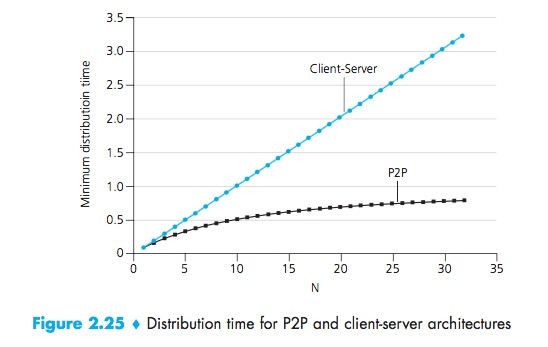

# Introduction

Generally, we see web applications employ client-server architecture.  In this architecture, many clients (remote processors) request and receive service from a centralized server. It creates a significant reliance on always-on infrastructure servers. In Peer to Peer architecture, there is minimal (or no) reliance on dedicated servers in data centers. Instead, the application exploits direct communication between the immediately connected hosts, called peers. The peers are not controlled by the service provider but are instead desktops and laptops controlled by users, with most of the peers residing in homes, universities, and offices. Because peers communicate without passing through a dedicated server, the architecture is called peer-to-peer. Many popular traffic-intensive applications are based on P2P architecture, for Example- BitTorrent(File Sharing), Skype(Internet Telephony), Distributed databases, etc.

## P2P File Sharing

P2P architecture is very popular for sharing large files. The primary reason for this is that, in client-server file distribution, a server must send a copy of the file to each of the clients- placing a huge burden on the server and bandwidth. In P2P file distribution, each peer can redistribute any portion of the file it has received to any of the other peers, thereby assisting the server in the distribution process.

## Scalability

**Distribution Time-** The distribution time is the time it takes to get a copy of the file to all `N` peers/clients.

The figure above compare the minimum distribution time for the client-server and P2P architectures assuming that all peers have the same upload rate. We see from figure that for the client-server architecture, the distribution time increases linearly and without bound as the number of peers increases. Hence the minimum distribution time in P2P architecture is always less than client-server architecture.

## BitTorrent

BitTorrent is a P2P file-sharing protocol. In BitTorrent lingo, the collection of all peers participating in the distribution of a particular file is called a torrent. Peers in torrent download equal-size chunks of the file from one another, with a typical chunk size of 256 kilobytes. A peer while downloading the missing chunks also uploads the chunks that it has, to other peers. Once a peer has downloaded the whole file, it may leave the torrent, or remain in the torrent and continue to upload chunks to other peers. Let's now take a look at how BitTorrent operates.

* Each torrent has an infrastructure node called a tracker. When a peer joins a torrent, it registers itself with the tracker and periodically informs the tracker that it is still in the torrent. This way tracker keeps the track of the peers that are participating in the torrent.
* When a new user joins the torrent, the tracker randomly selects a subset of peers(say 50) and sends the IP addresses of these peers to this new peer. The new peer then tries to make TCP connections with all the peers from the subset. As time evolves, some peers may leave and others will join this subset of peers.
* At any given time, each peer will have a subset of chunks from the file, with different peers having different subsets. Periodically each peer will ask its neighboring peers for the list of chunks they have. Based on this information a peer issue requests for the chunks it currently does not have.

**With the above information, now, a peer has to make two important decisions. First, which chunk it should request first. Second, to which of its neighbors should it send requested chunks.**

* To decide which chunks to request, a peer uses a technique called rarest first. The idea is to request the chunks that are rarest among its neighbors first. In this manner, the rarest chunks get quickly redistributed.
* To determine which request a peer should respond to, priority is given to the peers that are currently supplying data at the highest rate. Every 10 seconds, a peer recalculates the rates and possibly modifies the set of its neighbors.
* Importantly, every 30 seconds a peer also picks up an additional peer randomly and send chunks. This way this pair may end up being the top uploader for each other if they are satisfied with the trading. This random neighbor selection also allows new peers to get chunks.