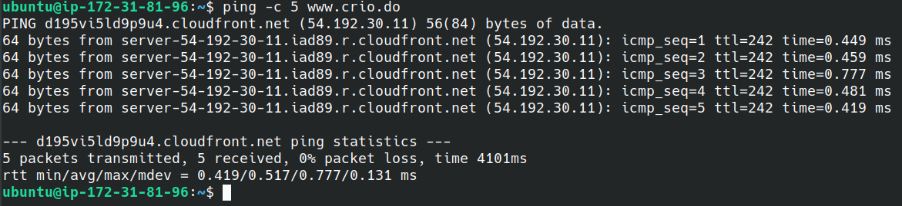
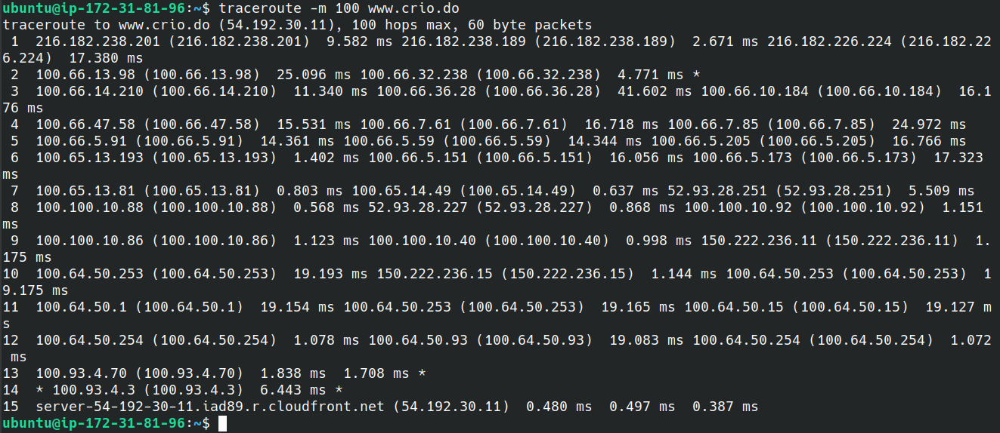
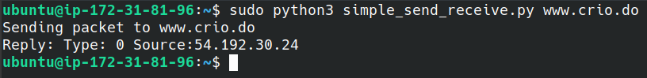
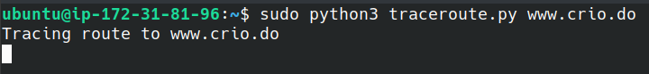
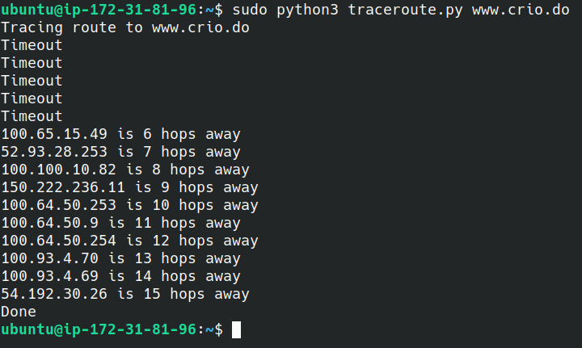

# Introduction

The essence of computer networking is to transport packets from one machine (source) to another (destination). In the current modern age, with high speed networking and the internet growing to a vast global network of various devices, we tend to take things such as how a simple packet of data containing your request to fetch the content at, say, `www.crio.do`, moves from your computing device to the server where Crio's website resides.

This MicroByte explores the basics of packet routing and demonstrates the concept behind `traceroute` - a popular utility used to find some of the paths taken by a packet to reach a destination.

There are small activities along the way with helpful screenshots to guide you along in the learning of this fundamental concept.

# Prerequisites

It would be helpful, but not necessary, to know about the TCP/IP protocol stack and how your requests from a browser are converted into packets and transmitted over the network.

This MicroByte includes the development of a simple program that shows how `traceroute` works. The programming language used will be Python. You should have Python 3 installed.

Any commands executed will assume a Linux operating system.

# Activity 1

Before we can get to the exciting part of building a traceroute program, it is a must to learn how a packet moves across the internet. Packets do not magically go from your device to a destination, instead they 'hop' from one device to another along the way and finally get to their destination - hopefully. What devices are along the way? These special devices that help support the infrastructure of the internet are called Routers. Every time a packet shows up at a router, the router decides where to send it in order to move it one step closer to the destination.

Let's send some packets and see what happens.

> **Task:** 
>
> Use the `ping` command  to send a special type of packet called an ICMP packet. `ping` is often used to test connectivity between devices.
>
> Try to ping `www.crio.do`.
>
> Do you know why the output is as it is?

> **Notes:**
>
> - The TTL (Time-To-Live) value indicates how many hops the packet can perform before being dropped (deleted).

<details>
<summary>Done with the task? Expand this to see the expected output</summary>

Command to be run `ping www.crio.do`



You would have noticed that there is a TTL value reported back to you. This indicates that the packet sent made many hops in order to reach the destination. Usually, the max TTL is 255 [TTL - Wikipedia][2].
</details>

# Activity 2

We have seen that the packet takes quite a number of hops to reach the destination. Can we get an itinerary for the packet's long journey? Sure we can. This is the job of the `traceroute` program. Traceroute works on the principle that a router will send back an ICMP TTL expired packet once a packet with no hops arrives at it. 

> **Task:**
>
> Run the `traceroute` command for `www.crio.do`. Observe the different routers reached and the number of hops. Since Crio's server may be quite far away, you may need to use a flag to set a higher number for number of hops for traceroute.

> **Notes:**
>
> - In the event that traceroute outputs `***` as the output for a particular hop, it means that the router did not send back a TTL expired message. [ServerFault Answer][1]

<details>
<summary>Done with the task? Expand this to see the expected output</summary>

Command to be run : `traceroute -m 100 www.crio.do`

Output:

</details>

# Activity 3

The basic principle behind the traceroute is to send out multiple packets with the same destination, but varying values of TTL for each one. When a packet reaches a router and is dropped, the router sends back a message informing the sender about this drop.

It is now time to build our own traceroute program in Python.

## Activity 3.1

We need to install a library that helps us work with packets - `scapy`.

> **Task**:
>
> Go ahead and install `scapy`. Ensure that you use pip for Python 3. 

> **Note:**
>
> - You have to use `sudo` for the `pip` install because the code requires root to run.

<details>
<summary>Need help?</summary>

`scapy` can be installed using pip. Remember to use `sudo`.
</details>

## Activity 3.2

> **Task:**
>
> Start off with a basic Python program that imports `scapy` correctly and creates a simple ICMP packet and sends it to a destination. Ensure that you output some information such as the IP addresses and response type so that you can see it.
>
> [Scapy documentation][3]

Try do this on on your own before looking at the sample code.

<details>
<summary>Need help?</summary>

Here is some logic you can follow:

```
Import scapy
Create an IP layer
Set its destination and TTL value
Create ICMP layer
Create the packet
Send the packet and wait for reply
Output the reply
```

Refer to [Simple send and receive code](./src/simple_send_receive.py) to see how a simple packet can be sent.
</details>

> **Task:**
>
> Run the program and observe the output. 

> **Note:**
>
> - You may have to use `sudo` to run the program.

If all went well, you should see something like this:



## Activity 3.3

> **Task:**
>
> Can you add a loop to the code to do this repetitively for increasing TTL values?
>
> Remember to check the reply packet Type before incrementing the value. The ICMP return value when the packet reaches the destination is `0`. Put simply, keep sending packets and listening in to responses until a reply packet shows up with a Type `0`.

<details>
<summary>Need help?</summary>
Here's some logic:

```
Import scapy
in a loop:
    Create an IP layer
    Set its destination and TTL value
    Create ICMP layer
    Create the packet
    Send the packet and wait for reply
    Output the reply
    Check the reply to ensure it has not reached the destination. If it has, then quit, otherwise, increment TTL and loop.
```

Refer to the [traceroute code](./src/traceroute.py) for the completed program code.
</details>

> **Task:** 
>
> Run the traceroute program you just created and observe the output.

> **Note:**
>
> You may need to use `sudo` to run the program.

If all went well, you should see something similar to this:



Wait...what's this? No output? (Note: You may actually see some output and the program may even complete, however, this depends on the route your packet takes through the internet).

If you remember a note point made earlier in this MicroByte, you might know the reason why this is happening.

<details>
<summary>Need a hint?</summary>

The reason is that the `sr1` function is infinitely waiting until the reply comes. What if there is no reply? (Remember the `***` from earlier?)
</details>

## Activity 3.4

Can you fix the issue discovered in Activity 3.3 above? 

<details>
<summary>Need a hint?</summary>

This issue can be solved by adding a timeout to the traceroute code. In the event of a timeout, continue executing after incrementing the TTL.
</details>

If you were able to solve the issue, you should see output similar to this:



Refer to the completed program for the timeout version [Traceroute with timeout](./src/traceroute_with_timeouts.py).

# Conclusion

You should now have understood the logic behind the mighty `traceroute` and have a glimpse of the underlying process of routing that supports the internet that has become such an essential aspect of our lives.

# References
1. Traceroute outputs `***` (https://serverfault.com/a/334039)
2. TTL - Wikipedia (https://en.wikipedia.org/wiki/Time_to_live)
3. Scapy Docs (https://scapy.readthedocs.io/en/latest/index.html)

[1]: <https://serverfault.com/a/334039> "Traceroute outputting `***`"

[2]: https://en.wikipedia.org/wiki/Time_to_live "TTL - Wikipedia"

[3]: https://scapy.readthedocs.io/en/latest/index.html "Scapy Docs"